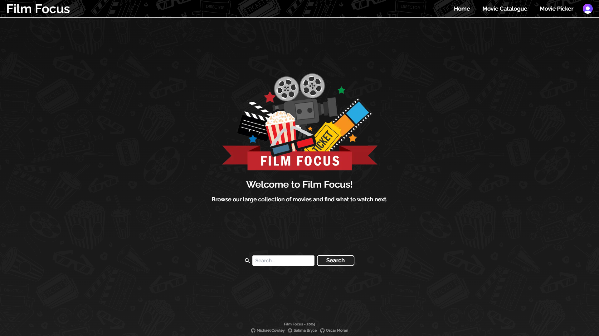
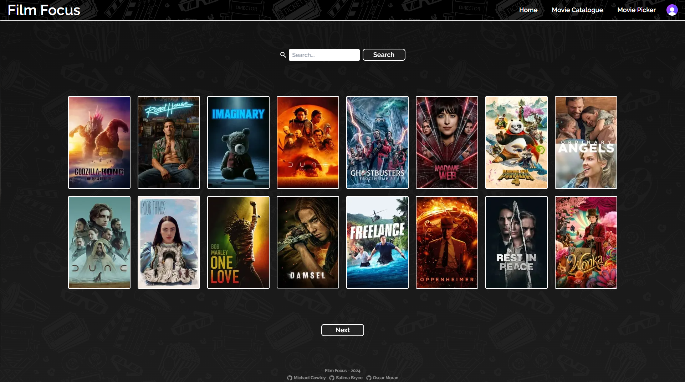
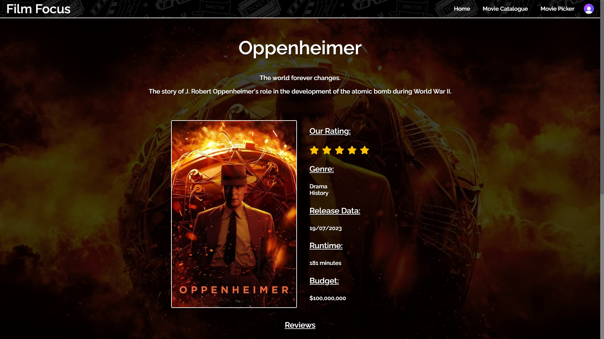
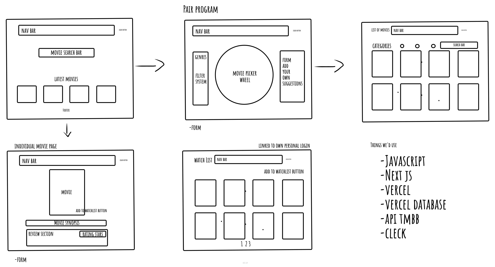

# Film Focus

The application is deployed on Vercel and can be viewed [here](https://film-focus-roan.vercel.app/)

## About the project

Film Focus is a movie database app that allows users to explore and review movies. It interacts with [The Movie Database API](https://developer.themoviedb.org/docs/getting-started) to fetch the movie data. Users can login using [Clerk](https://clerk.com/docs) and add reviews for all users to see.





## Team members and project management

#### Contributors:

- Michael Cowley
- Oscar Moran
- Salima Bryce

#### Project management:

- **Trello:** We created a [Trello board](https://trello.com/b/8t6bsPwp/film-focus) to organise tasks and monitor our progress throughout development.
- **Shared Programming:** We utilised shared programming to collaborate on code development in real-time, ensuring all team members were involved and encourage sharing of knowledge.
- **Git Branches:** We frequently used Git branches to push code changes so we could manage conflicts, access the latest code additions and collaborate seamlessly.

## Wireframe

This is the wireframe we made during the planning phase of the project to design the layout and content of the app.



## User stories and problem domain

#### Project aim:

The aim of this project was to collaborate as a team and create a movie database app by implementing an API. We wanted to make the app user friendly and provide features such as a search bar, user login and explore movies with user reviews.

#### Minimum Viable Product (MVP):

- Implement Clerk to provide authentication, enabling users to sign in.
- Integrate an API to fetch and display a diverse collection of movies.
- Allow users to search for movies and access details and reviews on each movie.
- Enable users to add, edit and delete their reviews on movies.
- Design an appealing user interface, with mobile and ARIA support for accessibility.

Stretch Goals:

- Implement a wheel picker library component that spins and returns a random movie to watch.
- Allow users to add movies to their personal watchlist that they intend to watch later.
- Utilise an animation library to enhance the appearance of the application.

#### User stories:

As a user, I want to...

- Explore a list of movies so I can find movies to watch.
- Search for movies using a search bar, so I can quickly find the movie I'm looking for.
- Click on a movie to access its details and reviews, allowing me to learn more about the movie.
- Login with an account so I can write a review, and have the ability to edit and delete them.
- Add movies to my personal watchlist so that I can manage the movies I plan to watch when logged in.
- Input movies into a wheel and spin it so it randomly selects a movie for me to watch.

#### Future additions:

- Watchlist - Allow users to add movies to their personal watchlist so they can keep track of movies they wish to watch.
- ~~Filter Movies - Add more search options such as sorting by category.~~
- View Profiles - Allow users to visit other profiles and view their watchlist and reviews.
- More CSS - Make our app look even better with more styling and animations.

## Setup

#### Dependencies

- [Clerk](https://clerk.com/docs)
- [Framer Motion](https://www.framer.com/motion/introduction/)
- [React Custom Roulette](https://github.com/effectussoftware/react-custom-roulette#readme)
- [React Icons](https://react-icons.github.io/react-icons/)

#### Getting started

This is a [Next.js](https://nextjs.org/) project bootstrapped with [`create-next-app`](https://github.com/vercel/next.js/tree/canary/packages/create-next-app).

First, run the development server:

```bash
npm run dev
# or
yarn dev
# or
pnpm dev
# or
bun dev
```

Open [http://localhost:3000](http://localhost:3000) with your browser to see the result.

You can start editing the page by modifying `app/page.js`. The page auto-updates as you edit the file.

This project uses [`next/font`](https://nextjs.org/docs/basic-features/font-optimization) to automatically optimize and load Inter, a custom Google Font.

## References

- [Background image](https://www.freepik.com/free-vector/seamless-pattern-with-cinema-elements_8084126.htm#fromView=search&page=1&position=3&uuid=8719aad5-af17-449a-bd4a-b0f7b2333da2)
- [Clerk](https://clerk.com/docs)
- [Favicon](https://www.flaticon.com/)
- [Google fonts](https://fonts.google.com/)
- [Logo image](https://www.cleanpng.com/png-cinema-film-director-television-film-digital-mille-3564111/)
- [The Movie Database](https://developer.themoviedb.org/docs/getting-started)
